<!-- Custom circuit artwork lives in assets/. All biographical content is also readable as text. -->
<picture>
  <source media="(max-width: 600px) and (prefers-color-scheme: dark)" srcset="./assets/hero-dark-mobile.svg" />
  <source media="(max-width: 600px)" srcset="./assets/hero-light-mobile.svg" />
  <source media="(prefers-color-scheme: dark)" srcset="./assets/hero-dark.svg" />
  
</picture>

<h1 align="center">Engineering across hardware &amp; software.</h1>

  <strong>Computer Engineer</strong> 
  AI Engineer · Embedded AI · Web Developer · App Developer · End-to-End Builder

  

  <strong>Available for work</strong> · Open to collaboration &amp; new ideas 
  ENV: Hybrid — expertise spanning hardware &amp; software

## 01 / Profile

I'm **Muhammad Faza (MF)**, a Computer Engineer connecting **AI, software, and embedded systems** to solve real-world problems.

My experience spans AI engineering, web development, and app development. I turn ideas into functional, scalable, and useful products, bringing hardware and software together from concept to implementation. I'm drawn to new challenges and innovations that push the boundaries of technology.

## 02 / Skills

### Hardware & embedded systems

<code>Python</code> <code>C++</code> <code>C</code> <code>Electronic Assembly</code>

### Web & application development

**Languages** 
<code>JavaScript</code> <code>TypeScript</code> <code>Dart</code>

**Frameworks & build tools** 
<code>React</code> <code>Next.js</code> <code>Vite</code> <code>Flutter</code>

**Interface development** 
<code>HTML5</code> <code>CSS3</code> <code>Tailwind CSS</code>

### Backend & databases

**Runtime & frameworks** 
<code>Node.js</code> <code>Hono</code> <code>Express</code>

**Data** 
<code>Database Management (SQL)</code> <code>MySQL</code>

### Tools

<code>Arduino</code> <code>VS Code</code> <code>MATLAB</code> <code>MySQL</code>

## 03 / Projects

**Explore my pinned repositories below this README.** ↓ 
Each project represents a chapter of my work.

For a closer look at my work and background, [**explore my portfolio ↗**](https://muhammadfaza.vercel.app/).

## 04 / GitHub activity

<picture>
  <source media="(prefers-color-scheme: dark)" srcset="https://github-profile-summary-cards.vercel.app/api/cards/profile-details?username=MuhammadFaza-DU&amp;name=Muhammad%20Faza&amp;bg_color=0D1117&amp;text_color=B6C6C0&amp;title_color=34D399&amp;chart_color=34D399&amp;border_color=0D1117" />
  
</picture>

<picture>
  <source media="(prefers-color-scheme: dark)" srcset="https://github-readme-stats-fast.vercel.app/api?username=MuhammadFaza-DU&amp;show_icons=true&amp;hide_border=true&amp;title_color=34D399&amp;icon_color=34D399&amp;text_color=B6C6C0&amp;bg_color=0D1117&amp;rank_icon=github&amp;include_all_commits=true&amp;border_radius=8" />
  
</picture>
<picture>
  <source media="(prefers-color-scheme: dark)" srcset="https://github-readme-stats-fast.vercel.app/api/top-langs/?username=MuhammadFaza-DU&amp;hide_border=true&amp;title_color=34D399&amp;text_color=B6C6C0&amp;bg_color=0D1117&amp;layout=donut&amp;border_radius=8" />
  
</picture>

<a href="https://github.com/MuhammadFaza-DU?tab=repositories">Browse repositories</a> · <a href="https://github.com/MuhammadFaza-DU?tab=overview">View contribution activity</a>

## 05 / Principle

<picture>
  <source media="(prefers-color-scheme: dark)" srcset="./assets/principle-dark.svg" />
  
</picture>

> “1.0001 is better than 1” — Muhammad Faza

## 06 / Connect

I'm available for work and open to collaboration and new ideas.

**[Explore my portfolio ↗](https://muhammadfaza.vercel.app/)** — get to know my work and background.

[LinkedIn](https://www.linkedin.com/in/m-faza-443479372/) · [Instagram](https://www.instagram.com/mfaz.aa?igsh=MWVlMDdrbDVjZzhjYg==) · [YouTube](https://www.youtube.com/@MuhammadFaza-justone) · [TikTok](https://www.tiktok.com/@mfaz.aa?is_from_webapp=1&sender_device=pc)

   
  Crafted with precision — Muhammad Faza © 2025

